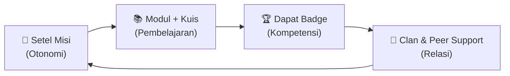
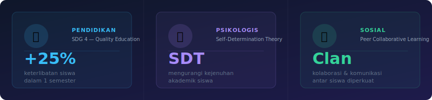

<div align="center">

<!-- BANNER -->


<!-- BADGES -->
<br/><br/>


<br/>


<br/>

### 🎯 *Platform Edukasi Pajak Adaptif Berbasis Multi-Agent RAG untuk Pelajar Indonesia*

**Misi kami:** Demokratisasi literasi perpajakan melalui gamifikasi yang berbasis ilmu motivasi — bukan sekadar poin dan level, tapi pengalaman belajar yang benar-benar *memuaskan*.

<br/>


</div>

---

## 🧠 Mengapa TAXA?

> *"30% siswa tidur di jam kosong, 23% main game, hanya 9% belajar."*

LMS konvensional hanya menghitung nilai. **TAXA** menghitung *motivasi*.

| Masalah | Solusi TAXA |
|---|---|
| 🔒 "Aku ga bisa milih apa yang mau dipelajari" | **Misi Mandiri** — tentukan topik, durasi, dan ritmemu sendiri |
| 😩 "Belajar ga pernah terasa rewarding" | **Umpan Balik Instan** — badge + poin AI langsung setelah kuis |
| 🧍 "Belajar itu sepi" | **Clan** — kelompok belajar dengan peta keahlian AI |

<br/>

## 🔄 Alur Pembelajaran



1. **🎯 Setel Misi** → Pilih topik, durasi, dan tingkat kesulitan
2. **📚 Belajar** → Modul interaktif yang disesuaikan dengan levelmu
3. **🏆 Kompetisi** → Kuis berbasis AI dengan reward badge instan
4. **👥 Kolaborasi** → Masuk Clan, lihat siapa yang butuh bantu, saling membantu

<br/>

## 🛠 Tech Stack

<table>
<tr>
<td><strong>Frontend</strong></td>
<td>
 &nbsp;
 &nbsp;
 &nbsp;

</td>
</tr>
<tr>
<td><strong>Backend AI</strong></td>
<td>
 &nbsp;
 &nbsp;
 &nbsp;

</td>
</tr>
<tr>
<td><strong>Database</strong></td>
<td>
 &nbsp;
 &nbsp;
 &nbsp;

</td>
</tr>
<tr>
<td><strong>Deploy</strong></td>
<td>
 &nbsp;

</td>
</tr>
</table>

<br/>

## 📁 Struktur Proyek

```
taxa/
├── apps/
│   └── web/              # Vite + React-TS frontend
│                         # (Tailwind, TanStack Query, react-router-dom, Supabase client)
├── services/
│   └── ai/               # Python FastAPI — multi-agent RAG, adaptive engine
│                         # (LangChain, Supabase server, OpenAI)
├── packages/
│   └── shared/           # Shared TypeScript types & constants
├── supabase/
│   └── migrations/       # SQL migrations + RLS policies
├── docs/                 # Research notes, wireframes, meeting records
├── .env.example          # Root env template
├── .gitignore
└── AGENTS.md             # Guidelines untuk AI coding agents
```

<br/>

## ❓ Kenapa Stack Ini?

| Tool | Alasan |
|---|---|
| **Vite + React** | Bundler tercepat saat ini, bundle kecil — penting untuk low-end phone siswa Indonesia. Next.js overkill tanpa SSR. |
| **TypeScript** | Catch bug saat development bukan runtime — critical untuk app dengan banyak state (misi, badge, clan). |
| **TanStack Query** | Server state + caching tanpa Redux boilerplate. Realtime badge/progress langsung ter-sync. |
| **Tailwind CSS** | Utility-first → UI cepat tanpa context-switch ke CSS file terpisah. Zero runtime overhead. |
| **Supabase** | PostgreSQL + Auth + Realtime dalam satu paket. RLS built-in untuk isolasi data antar siswa. |
| **FastAPI** | Async Python terbaik untuk AI/ML workload. Native async, auto OpenAPI docs, integrasi LangChain mulus. |
| **LangChain** | Ekosistem multi-agent RAG paling matang di Python. Adaptive engine & peer-support mapper jadi lebih mudah dibangun. |

<br/>

## 🔑 Environment Variables

```bash
# Frontend
cp apps/web/.env.example apps/web/.env

# AI Backend
cp services/ai/.env.example services/ai/.env
```

> ⚠️ `VITE_` prefix = aman di browser (anon key, URL publik).
> `SUPABASE_SERVICE_KEY` dan `OPENAI_API_KEY` = server-only, jangan pernah ke frontend.

<br/>

## 🚀 Getting Started

```bash
# 1. Clone repo
git clone https://github.com/firdausmntp/TAXA.git
cd TAXA

# 2. Frontend
cd apps/web
cp .env.example .env        # isi VITE_SUPABASE_URL, VITE_SUPABASE_ANON_KEY
npm install
npm run dev                 # http://localhost:5173

# 3. AI Backend
cd ../../services/ai
cp .env.example .env        # isi SUPABASE_SERVICE_KEY, OPENAI_API_KEY
pip install -r requirements.txt
uvicorn main:app --reload   # http://localhost:8000
```

<br/>

## 🌍 Dampak — SDG Alignment

<div align="center">


<br/><br/>



</div>

<br/>

## 🤖 Kontribusi AI

| Komponen | Peran |
|---|---|
| **Adaptive Mission Engine** | Rekomendasikan tingkat kesulitan berdasarkan riwayat performa |
| **Personalized Feedback** | Ringkasan umpan balik otomatis & terpersonalisasi |
| **Skill Gap Detection** | Identifikasi kekuatan & kelemahan untuk collaborative matching |
| **Peer Support Mapper** | Peta keahlian real-time untuk setiap anggota Clan |

<br/>

## 👥 Tim

<div align="center">

| | Nama | Peran |
|---|---|---|
| 👑 | **Azhriler Lintang** | Ketua Tim |
| 💻 | **Mujadid Akbar Paryono** | Anggota |
| 🎨 | **Abdulhadi Muntashir** | Anggota |
| 📊 | **Firdaus Satrio Utomo** | Anggota |

<br/>

**🏛 Universitas Sultan Ageng Tirtayasa**

</div>

---

<div align="center">


<br/><br/>

**Samsung Solve for Tomorrow 2026** — *Solving for tomorrow. Today.*

</div>
