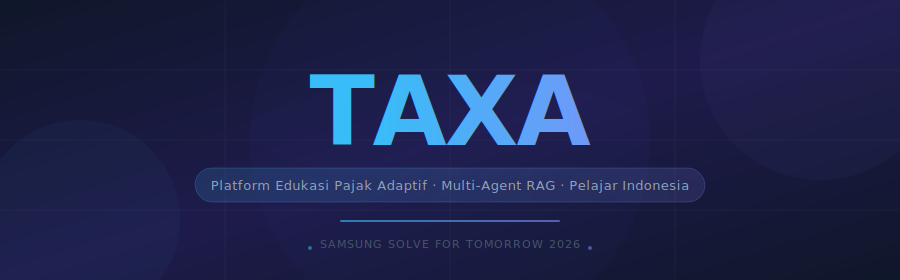
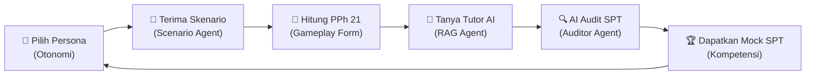

<div align="center">

<!-- BANNER -->


<!-- BADGES -->
<br/><br/>


<br/>


<br/>

### 🎯 *Platform Edukasi Pajak Adaptif Berbasis Multi-Agent RAG untuk Pelajar Indonesia*

**Misi kami:** Mendemokratisasi literasi perpajakan bagi Gen Z dan Gen Alpha di Indonesia melalui pengalaman simulasi roleplay berbasis AI yang interaktif, personal, dan presisi, sehingga melahirkan generasi "Smart Taxpayer" yang siap menghadapi dinamika ekonomi digital.

<br/>


</div>

---

## 🧠 Mengapa TAXA?

*Literasi keuangan di sekolah sering kali mengabaikan perpajakan, padahal ekosistem ekonomi digital (gig economy) memicu banyak Gen Z/Alpha berpenghasilan sejak muda.*

**TAXA** menggunakan pendekatan **Self-Determination Theory (SDT)** untuk menyajikan pembelajaran perpajakan yang interaktif:

| Kebutuhan SDT | Skenario TAXA | Penerapan Fitur |
|---|---|---|
| **Otonomi** | *"Aku bisa memilih skenario belajarku"* | **Pilihan Persona Karier** — Pilih peran (Freelancer, Streamer, dll.) atau input skenario finansial sendiri. |
| **Kompetensi** | *"Aku tahu kemampuanku secara instan"* | **AI Auditor & Mock SPT** — Validasi perhitungan PPh 21 secara real-time dan unduh Mock SPT asli. |
| **Relasi** | *"Aku tidak belajar sendirian"* | **Clan & Peer Support** — Lihat peta progres rekan se-tim untuk berkolaborasi dan membantu kesulitan hitung. |

<br/>

## 🔄 Alur Pembelajaran (Simulasi Pajak)



1. **👤 Pilih Persona** → Pengguna memilih karier modern (misal: Freelance Developer, YouTuber).
2. **📄 Terima Skenario** → AI Scenario Agent menghasilkan data pendapatan kotor, pengeluaran, dan status PTKP secara logis.
3. **🧮 Hitung PPh 21** → Mengisi form pajak interaktif langkah-demi-langkah (klasifikasi bruto, neto, PTKP, progresif TER).
4. **💬 Tanya Tutor AI** → Chatbot cerdas bertenaga RAG (dikunci UU HPP resmi) membantu memahami jargon pajak tanpa halusinasi.
5. **🔍 AI Audit SPT** → Auditor Agent memvalidasi hasil hitungan. Jika salah, AI memberikan feedback adaptif.
6. **🏆 Dapatkan Mock SPT** → Cetak formulir SPT tersimulasi (PDF) dan peroleh badge pencapaian.

<br/>

## 🛠 Tech Stack

<table>
<tr>
<td><strong>Frontend</strong></td>
<td>
 &nbsp;
 &nbsp;
 &nbsp;
 &nbsp;

</td>
</tr>
<tr>
<td><strong>Backend AI</strong></td>
<td>
 &nbsp;
 &nbsp;
 &nbsp;

</td>
</tr>
<tr>
<td><strong>Database & Auth</strong></td>
<td>
 &nbsp;
 &nbsp;
 &nbsp;

</td>
</tr>
<tr>
<td><strong>Deploy</strong></td>
<td>
 &nbsp;

</td>
</tr>
</table>

<br/>

## 📁 Struktur Proyek

```
taxa/
├── apps/
│   └── web/              # Vite + React + TS frontend (Tailwind, TanStack Query, Supabase client)
├── services/
│   └── ai/               # Python FastAPI — multi-agent RAG, adaptive engine (LangChain, OpenAI)
├── packages/
│   └── shared/           # Shared TypeScript types & constants
├── supabase/
│   └── migrations/       # SQL migrations + RLS policies
├── docs/                 # Research notes, wireframes, meeting records
├── .env.example          # Root env template
├── .gitignore
├── AGENTS.md             # Panduan ringkas AI coding agents
├── brain.md              # Persistent memory log untuk AI agents
├── prd.md                # Product Requirements Document (Source of Truth)
├── srs.md                # Software Requirements Specification (Source of Truth)
├── tdd.md                # Technical Design Document (Source of Truth)
└── README.md             # File ini
```

<br/>

## ❓ Kenapa Stack Ini?

| Tool | Alasan |
|---|---|
| **Vite + React** | Bundler super cepat dengan build size kecil, sangat optimal untuk HP kelas menengah/kebawah milik pelajar Indonesia. |
| **TypeScript** | Meminimalisir bug logika perhitungan pajak sejak masa development secara statis. |
| **TanStack Query** | State management efisien untuk sinkronisasi state data kuis, XP, dan misi secara real-time. |
| **Tailwind CSS** | Styling modern, responsif, dan zero-runtime overhead. |
| **Supabase** | Backend-as-a-Service dengan PostgreSQL relasional. Menyediakan `pgvector` untuk pencarian regulasi pajak dan RLS untuk keamanan data. |
| **FastAPI + LangChain** | Lingkungan Python yang tangguh dan asinkron untuk menangani sistem RAG Agent (Tutor) dan Agent Matematika (Auditor). |

<br/>

## 🔑 Environment Variables

```bash
# Frontend
cp apps/web/.env.example apps/web/.env

# AI Backend
cp services/ai/.env.example services/ai/.env
```

> ⚠️ Perhatian: Key sensitif seperti `SUPABASE_SERVICE_KEY` dan `OPENAI_API_KEY` wajib diamankan di environment backend dan dilarang dipaparkan ke frontend.

<br/>

## 🚀 Getting Started

```bash
# 1. Clone repo
git clone https://github.com/firdausmntp/TAXA.git
cd TAXA

# 2. Setup Frontend
cd apps/web
cp .env.example .env        # Isi variabel VITE_SUPABASE_URL, VITE_SUPABASE_ANON_KEY
npm install
npm run dev                 # Berjalan di http://localhost:5173

# 3. Setup AI Backend
cd ../../services/ai
cp .env.example .env        # Isi variabel SUPABASE_SERVICE_KEY, OPENAI_API_KEY
pip install -r requirements.txt
uvicorn main:app --reload   # Berjalan di http://localhost:8000
```

<br/>

## 🌍 Dampak & Kontribusi AI (SDG 4 - Quality Education)

*   **Adaptive Scenario & Mission Engine:** Memproduksi skenario finansial personal sesuai persona siswa.
*   **Zero-Hallucination Tutor (RAG):** Memberikan edukasi perpajakan yang dijamin akurat berdasarkan dokumen UU HPP resmi.
*   **Deterministic Auditor Agent:** Membimbing proses belajar mandiri dengan melakukan audit matematis dan memberikan umpan balik spesifik per baris form SPT.

<br/>

## 👥 Tim

<div align="center">

| | Nama | Peran |
|---|---|---|
| 👑 | **Azhriler Lintang** | Ketua Tim |
| 💻 | **Mujadid Akbar Paryono** | Anggota |
| 🎨 | **Abdulhadi Muntashir** | Anggota |
| 📊 | **Firdaus Satrio Utomo** | Anggota |

<br/>

**🏛 Universitas Sultan Ageng Tirtayasa**

</div>

---

<div align="center">


<br/><br/>

**Samsung Solve for Tomorrow 2026** — *Solving for tomorrow. Today.*

</div>
